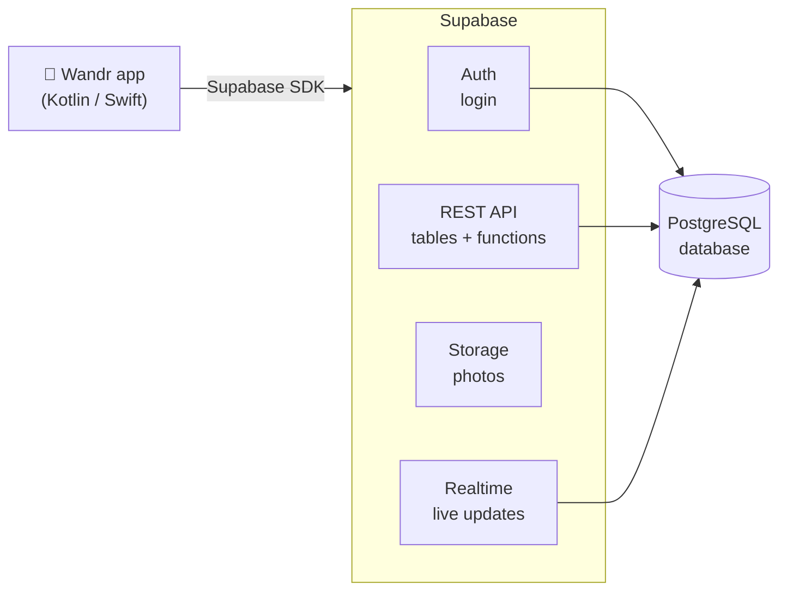
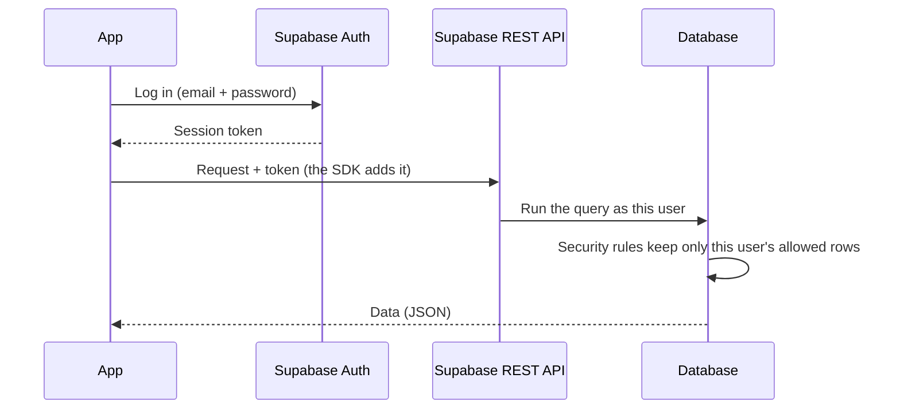

# Wandr - Backend Guide

[](https://supabase.com/dashboard/project/cugtwwqqxczwtkfkubrf/integrations/data_api/docs)
[](sql/README.md)

This guide explains how the Wandr app talks to its backend and which call to
make on each screen.

## Contents

<table style="border-collapse: collapse; border: none;">
  <tr style="border: none;">
    <td style="border: none;" valign="top">
      <ul style="margin: 0; padding-left: 20px;">
        <li><a href="#what-is-supabase">What is Supabase?</a></li>
        <li><a href="#connection">Connection</a></li>
        <li><a href="#how-a-request-works">How a request works</a></li>
        <li>
          <a href="#setup">Setup</a>
          <ul>
            <li><a href="#kotlin-android">Kotlin (Android)</a></li>
            <li><a href="#swift-ios">Swift (iOS)</a></li>
          </ul>
        </li>
        <li><a href="#what-to-call-on-each-screen">What to call on each screen</a></li>
        <li>
          <a href="#code-examples">Code examples</a>
          <ul>
            <li><a href="#log-in-and-sign-up">Log in and sign up</a></li>
            <li><a href="#read-a-table">Read a table</a></li>
            <li><a href="#filter">Filter</a></li>
            <li><a href="#call-a-function">Call a function</a></li>
            <li><a href="#delete-a-row">Delete a row</a></li>
          </ul>
        </li>
        <li><a href="#test-users">Test users</a></li>
      </ul>
    </td>
    <td style="border: none;" align="center" valign="middle">
        
    </td>
  </tr>
</table>

## What is Supabase?

Supabase is our whole backend. We don't run our own server. Supabase gives us:

- **A database** (PostgreSQL) where all the app data lives.
- **Login** (Auth): sign up, log in and log out with email and password.
- **A ready-made REST API**: every table can be read and changed through
  simple web requests, with no backend code.
- **Functions** for actions with rules, like finishing a quest or joining an event.
- **File storage** for photos.
- **Live updates** (Realtime), for example to move friends on the map.



📚 **Want to know what each table and column means?** Read the
[database docs](sql/README.md). You'll also find the diagrams, the test users
and their passwords there.

## Connection

```properties
SUPABASE_URL=https://cugtwwqqxczwtkfkubrf.supabase.co
SUPABASE_PUBLISHABLE_KEY=sb_publishable_YPjvNLSqznQitYTinqvabg_p8V5e8-i
```

## How a request works



The SDK saves the session and sends the token for you. You only need to log in once.

## Setup

### Kotlin (Android)

Add [supabase-kt](https://github.com/supabase-community/supabase-kt) to
`build.gradle.kts` (check the latest version on its page):

```kotlin
implementation(platform("io.github.jan-tennert.supabase:bom:VERSION"))
implementation("io.github.jan-tennert.supabase:postgrest-kt")
implementation("io.github.jan-tennert.supabase:auth-kt")
implementation("io.github.jan-tennert.supabase:storage-kt")
implementation("io.github.jan-tennert.supabase:realtime-kt")
implementation("io.ktor:ktor-client-android:KTOR_VERSION")
```

```kotlin
val supabase = createSupabaseClient(
    supabaseUrl = "https://cugtwwqqxczwtkfkubrf.supabase.co",
    supabaseKey = "sb_publishable_YPjvNLSqznQitYTinqvabg_p8V5e8-i"
) {
    install(Auth)
    install(Postgrest)
    install(Storage)
    install(Realtime)
}
```

### Swift (iOS)

Add [supabase-swift](https://github.com/supabase/supabase-swift) with Swift
Package Manager (`https://github.com/supabase/supabase-swift`):

```swift
import Supabase

let supabase = SupabaseClient(
    supabaseURL: URL(string: "https://cugtwwqqxczwtkfkubrf.supabase.co")!,
    supabaseKey: "sb_publishable_YPjvNLSqznQitYTinqvabg_p8V5e8-i"
)
```

## What to call on each screen

There are two kinds of calls:

- **Table**: read or change a table directly (`GET`, `POST`, `PATCH`, `DELETE` on `/rest/v1/<table>`).
- **Function**: an action with rules (`POST /rest/v1/rpc/<name>`). They are all
  explained in the [database docs](sql/README.md#functions-rpc).

`me` means the id of the logged-in user.

| Screen                     | What you need                            | Call                                                                                                                                                  |
| -------------------------- | ---------------------------------------- | ----------------------------------------------------------------------------------------------------------------------------------------------------- |
| **Sign up**                | Create the account                       | Auth `signUp`                                                                                                                                         |
|                            | Create the profile (right after sign up) | Table · `POST /users` with `id`, `name`, `email`                                                                                                      |
| **Log in**                 | Start a session                          | Auth `signIn`                                                                                                                                         |
| **Onboarding**             | List of interests                        | Table · `GET /tags`                                                                                                                                   |
|                            | Save interests                           | Table · `POST /user_interests` (a list of `{user_id, tag_id}`)                                                                                        |
|                            | Save energy level                        | Table · `PATCH /users?id=eq.me` with `energy_level`                                                                                                   |
| **Discovery Engine**       | Quests near me                           | Function · `nearby_quests(p_lat, p_lng, p_radius_km)`                                                                                                 |
|                            | All quests with place and tags           | Table · `GET /quests?select=*,places(name),quest_tags(tags(name))`                                                                                    |
| **Map**                    | Places near me                           | Function · `nearby_places(p_lat, p_lng, p_radius_km, p_category)`                                                                                     |
| **Quest Details**          | Quest, place and steps                   | Table · `GET /quests?id=eq.<id>&select=*,places(*),quest_objectives(*)&quest_objectives.order=order_index`                                            |
|                            | "Start quest" button                     | Function · `start_quest(p_quest_id)`                                                                                                                  |
| **Active Quest Tracker**   | My active quests and checked steps       | Table · `GET /quest_completions?user_id=eq.me&status=eq.pending&select=*,quests(title,quest_objectives(*)),quest_objective_completions(objective_id)` |
|                            | Check a step                             | Function · `complete_objective(p_quest_id, p_objective_id, p_photo_url)`                                                                              |
|                            | Give up                                  | Function · `abandon_quest(p_quest_id)`                                                                                                                |
| **Events**                 | Upcoming events and how many are going   | Table · `GET /events?starts_at=gte.<now>&select=*,places(name),event_attendees(count)&order=starts_at`                                                |
|                            | Join                                     | Function · `rsvp_event(p_event_id)`                                                                                                                   |
|                            | Leave                                    | Table · `DELETE /event_attendees?event_id=eq.<id>&user_id=eq.me`                                                                                      |
| **Friends on Quest (map)** | Share my location                        | Table · `POST /user_locations` with header `Prefer: resolution=merge-duplicates`                                                                      |
|                            | Friends near me                          | Function · `friends_on_map()`                                                                                                                         |
| **Friends**                | My friends and requests                  | Table · `GET /friendships`                                                                                                                            |
|                            | Send a request                           | Function · `send_friend_request(p_friend_id)`                                                                                                         |
|                            | Accept a request                         | Function · `accept_friend_request(p_friendship_id)`                                                                                                   |
|                            | Block                                    | Table · `PATCH /friendships?id=eq.<id>` with `status: "blocked"`                                                                                      |
|                            | Remove friend / decline                  | Table · `DELETE /friendships?id=eq.<id>`                                                                                                              |
| **Profile / Side Quests**  | Level, XP, streak, tier                  | Table · `GET /users?id=eq.me`                                                                                                                         |
|                            | My badges                                | Table · `GET /user_badges?user_id=eq.me&select=earned_at,badges(*)`                                                                                   |
|                            | Quest history                            | Table · `GET /quest_completions?user_id=eq.me&status=eq.completed&select=completed_at,quests(title,points_reward)`                                    |
| **Notifications**          | My notifications                         | Table · `GET /notifications?order=created_at.desc`                                                                                                    |
|                            | Mark as read                             | Table · `PATCH /notifications?id=eq.<id>` with `read_status: true`                                                                                    |

## Code examples

### Log in and sign up

```kotlin
// Kotlin
supabase.auth.signInWith(Email) {
    email = "valentina.gomez@example.com"
    password = "password123"
}
val me = supabase.auth.currentUserOrNull()?.id
```

```swift
// Swift
try await supabase.auth.signIn(email: "valentina.gomez@example.com", password: "password123")
let me = try await supabase.auth.session.user.id
```

### Read a table

```kotlin
// Kotlin
@Serializable
data class Quest(val id: String, val title: String, val points_reward: Int, val places: Place)

val quests = supabase.from("quests")
    .select(Columns.raw("*, places(*)"))
    .decodeList<Quest>()
```

```swift
// Swift
struct Quest: Decodable { let id: UUID; let title: String; let points_reward: Int; let places: Place }

let quests: [Quest] = try await supabase
    .from("quests")
    .select("*, places(*)")
    .execute()
    .value
```

### Filter

```kotlin
// Kotlin
val parks = supabase.from("places")
    .select { filter { eq("category", "park") } }
    .decodeList<Place>()
```

```swift
// Swift
let parks: [Place] = try await supabase
    .from("places")
    .select()
    .eq("category", value: "park")
    .execute()
    .value
```

### Call a function

```kotlin
// Kotlin
val result = supabase.postgrest.rpc("complete_objective", buildJsonObject {
    put("p_quest_id", questId)
    put("p_objective_id", objectiveId)
    put("p_photo_url", photoUrl)
}).decodeAs<ObjectiveResult>()
```

```swift
// Swift
let result: ObjectiveResult = try await supabase
    .rpc("complete_objective", params: [
        "p_quest_id": questId,
        "p_objective_id": objectiveId,
        "p_photo_url": photoUrl
    ])
    .execute()
    .value
```

If a function can't do the action, it returns an error with a clear message
(for example `This event is full` or `Quest is not in progress`). Show it to the user.

### Delete a row

```kotlin
// Kotlin
supabase.from("event_attendees").delete {
    filter {
        eq("event_id", eventId)
        eq("user_id", me)
    }
}
```

```swift
// Swift
try await supabase
    .from("event_attendees")
    .delete()
    .eq("event_id", value: eventId)
    .eq("user_id", value: me)
    .execute()
```

## Test users

Use any test user from the [database docs](sql/README.md#test-users) to log in.
All of them use the password `password123`.
