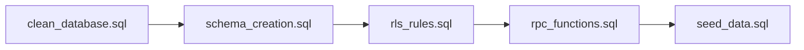
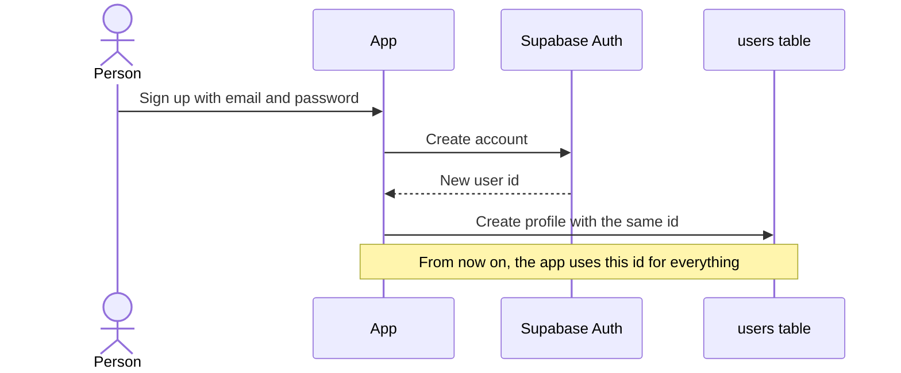
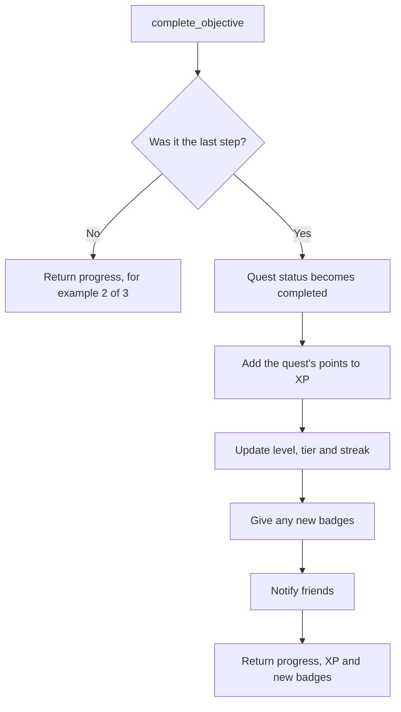
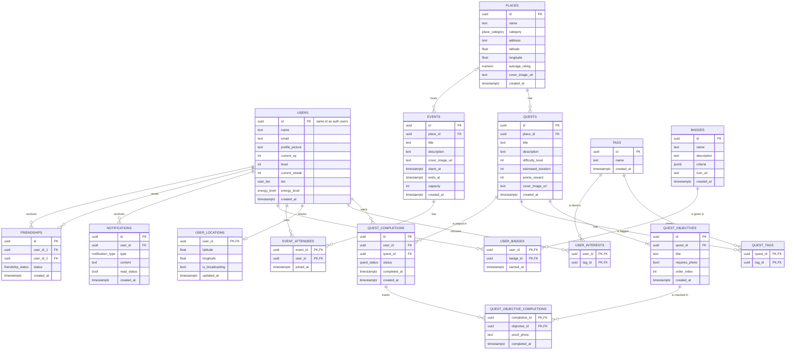
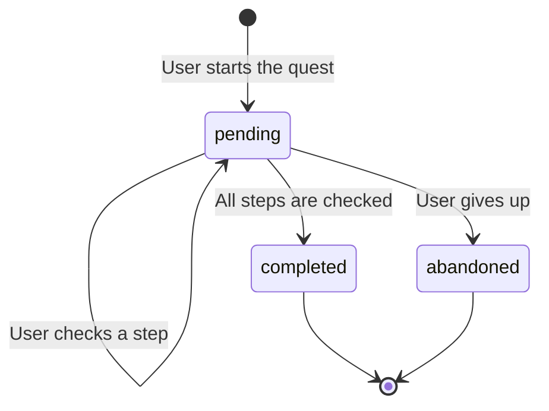
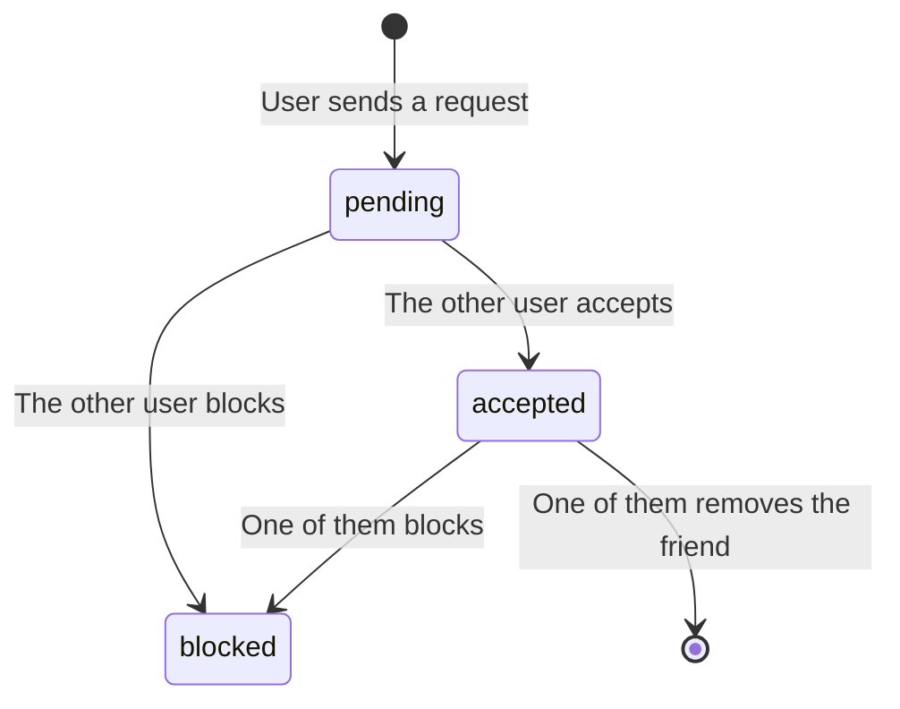

# Wandr Database

This folder has everything you need to build the Wandr database in Supabase.

## Files

| File | What it does |
| --- | --- |
| `schema_creation.sql` | Creates all the tables. |
| `rls_rules.sql` | Adds the security rules (who can see or change each row). |
| `rpc_functions.sql` | Adds the functions the app calls for actions with rules (finish a step, join an event...). |
| `seed_data.sql` | Fills the tables with fake data for testing. |
| `clean_database.sql` | **Deletes everything.** It removes all tables, functions and the test users. |

## How to run them

Open the **SQL Editor** in Supabase and run the files in this order:

The first time, you can skip `clean_database.sql` because there is nothing to delete yet.

## How login works (Supabase Auth)

We do **not** save passwords in our own tables. Supabase does that for us in a
hidden table called `auth.users`.

Our `users` table only holds the **profile** (name, XP, level, and so on).
Each profile uses the **same id** as its account in `auth.users`, so they are
always linked. If an account is deleted, its profile is deleted too.

### Security rules (RLS)

Every table is protected. In short:

- **Everyone logged in can read** places, quests, objectives, tags, badges,
  events, profiles and who is going to each event.
- **You can only change your own things**: your profile, your quest progress,
  your interests, your location, your RSVPs and your notifications.
- **Friends** can see the quests you finished. They can see your location
  **only** while you have location sharing turned on.
- **Badges and notifications** are given out by the server, not by the app.
- **XP, level, streak and tier** can't be edited by the app. They only change
  when a quest is finished through `complete_objective`.
- **Quest progress, event RSVPs and friend requests** can only be created
  through the [functions](#functions-rpc) below, so their rules are always checked.
- **Only the person who got a friend request can accept it.** Anyone in the
  friendship can block.

## Functions (RPC)

Some actions need more than saving a row. For example, finishing a quest also
gives XP, may give a badge and tells your friends. These actions live in
`rpc_functions.sql`, and the app calls them at `POST /rest/v1/rpc/<name>`.

| Function | Parameters | What it does |
| --- | --- | --- |
| `start_quest` | `p_quest_id` | Starts a quest. If you had abandoned it, it starts over. |
| `complete_objective` | `p_quest_id`, `p_objective_id`, `p_photo_url` (only if the step needs a photo) | Checks one step. If it was the last one, it finishes the quest (see below). |
| `abandon_quest` | `p_quest_id` | Gives up a quest that is in progress. |
| `rsvp_event` | `p_event_id` | Joins an event. Fails if it is full or already over. To leave, delete your row in `event_attendees`. |
| `send_friend_request` | `p_friend_id` | Sends a request and notifies the other person. |
| `accept_friend_request` | `p_friendship_id` | Accepts a request. Only the person who got it can do this. |
| `nearby_places` | `p_lat`, `p_lng`, `p_radius_km` (default 5), `p_category` (optional) | Places around you, closest first. |
| `nearby_quests` | `p_lat`, `p_lng`, `p_radius_km` (default 5) | Quests around you, closest first. |
| `friends_on_map` | none | Friends sharing their location, with how far they are and the quest they are doing. |

### What happens when the last step is checked

The rules for progress:

- **Level** = XP ÷ 200 + 1. It never goes down.
- **Tier** depends on the level:

  | Level | Tier |
  | --- | --- |
  | 1 to 4 | Bogota Scout |
  | 5 to 9 | Trailblazer |
  | 10 to 19 | Pathfinder |
  | 20 or more | Master Pathfinder |

- **Streak** goes up by 1 if your last finished quest was yesterday. It stays
  the same if it was today, and goes back to 1 if it was earlier. Days use
  Bogota time.

## Test users

`seed_data.sql` creates these accounts. You can log in with them from the app.

| Name | Email | Password | Level | Tier |
| --- | --- | --- | --- | --- |
| Valentina Gomez | valentina.gomez@example.com | `password123` | 8 | Trailblazer |
| Santiago Ramirez | santiago.ramirez@example.com | `password123` | 3 | Bogota Scout |
| Camila Torres | camila.torres@example.com | `password123` | 14 | Pathfinder |
| Juan David Suarez | juan.suarez@example.com | `password123` | 1 | Bogota Scout |

Friendships between them:

- Valentina and Santiago are friends.
- Valentina and Camila are friends.
- Santiago sent a friend request to Juan David. Juan David has not answered yet.
- Camila and Juan David are blocked.

These are fake accounts for testing only. Never use them in production.

## Entity-relationship diagram

## Tables

### users

The profile of each person who uses the app.

| Column | What it means |
| --- | --- |
| `id` | Unique id. It is the same id as the person's login account. |
| `name` | Full name. |
| `email` | Email address. No two users can have the same one. |
| `profile_picture` | Link to the profile photo. Can be empty. |
| `current_xp` | Experience points the user has. Starts at 0. |
| `level` | User level. Starts at 1. |
| `current_streak` | How many days in a row the user has been active. |
| `tier` | Rank of the user: `bogota_scout`, `trailblazer`, `pathfinder` or `master_pathfinder`. |
| `energy_level` | What kind of plans the user likes: `relaxed` or `active`. Chosen during onboarding. |
| `created_at` | When the profile was created. |

### places

Real places in the city where quests and events happen.

| Column | What it means |
| --- | --- |
| `id` | Unique id. |
| `name` | Name of the place. |
| `category` | Type of place: `park`, `bar`, `museum`, `restaurant`, `event`, `culture`, `outdoors` or `other`. |
| `address` | Street address. |
| `latitude`, `longitude` | Position on the map. |
| `average_rating` | Score from 0.0 to 5.0. |
| `cover_image_url` | Link to the main photo. |
| `created_at` | When it was added. |

### quests

A challenge the user can do at a place.

| Column | What it means |
| --- | --- |
| `id` | Unique id. |
| `place_id` | The place where the quest happens. |
| `title` | Short name of the quest. |
| `description` | Longer explanation. |
| `difficulty_level` | From 1 (easy) to 5 (hard). |
| `estimated_duration` | How long it takes, in minutes. |
| `points_reward` | XP the user gets for finishing it. |
| `cover_image_url` | Link to the main photo. |
| `created_at` | When it was added. |

### quest_objectives

The steps inside a quest (for example: "arrive", "order something", "take a photo").

| Column | What it means |
| --- | --- |
| `id` | Unique id. |
| `quest_id` | The quest this step belongs to. |
| `title` | What the user has to do. |
| `requires_photo` | `true` if the user must upload a photo to finish this step. |
| `order_index` | Position of the step in the list (1, 2, 3...). |
| `created_at` | When it was added. |

### tags

Labels like `food`, `music` or `outdoors`. They are used for quests and for user interests.

| Column | What it means |
| --- | --- |
| `id` | Unique id. |
| `name` | The label. No two tags can have the same name. |
| `created_at` | When it was added. |

### quest_tags

Links quests with tags. A quest can have many tags, and a tag can be on many quests.

| Column | What it means |
| --- | --- |
| `quest_id` | The quest. |
| `tag_id` | The tag. |

### quest_completions

A user's attempt at a quest. A user can only have one per quest.

| Column | What it means |
| --- | --- |
| `id` | Unique id. |
| `user_id` | Who is doing the quest. |
| `quest_id` | Which quest. |
| `status` | `pending`, `completed` or `abandoned`. |
| `completed_at` | When the quest was finished. Empty if it is not finished. |
| `created_at` | When the user started it. |

### quest_objective_completions

Which steps of a quest the user has already checked. This is how the app shows "2 of 3".

| Column | What it means |
| --- | --- |
| `completion_id` | The user's attempt (from `quest_completions`). |
| `objective_id` | The step that was checked. |
| `proof_photo` | Link to the photo, if the step needs one. |
| `completed_at` | When the step was checked. |

### user_interests

The interests a user picked during onboarding. Uses the same `tags` as quests.

| Column | What it means |
| --- | --- |
| `user_id` | The user. |
| `tag_id` | The interest. |

### user_locations

The last known position of each user, for the friends map. One row per user.

| Column | What it means |
| --- | --- |
| `user_id` | The user. |
| `latitude`, `longitude` | Position on the map. |
| `is_broadcasting` | `true` if the user is sharing their location with friends. |
| `updated_at` | When the position was last updated. |

### events

Activities with a fixed date and time, like "Salsa in the Park". They are different from quests: many people go together at the same time.

| Column | What it means |
| --- | --- |
| `id` | Unique id. |
| `place_id` | Where it happens. Can be empty. |
| `title` | Name of the event. |
| `description` | Longer explanation. |
| `cover_image_url` | Link to the main photo. |
| `starts_at` | When it starts. |
| `ends_at` | When it ends. Must be after `starts_at`. Can be empty. |
| `capacity` | Maximum number of people. Empty means no limit. |
| `created_at` | When it was added. |

### event_attendees

Who said they are going to each event (RSVP). To know how many people are going, count the rows.

| Column | What it means |
| --- | --- |
| `event_id` | The event. |
| `user_id` | The person going. |
| `joined_at` | When they signed up. |

### badges

Awards users can earn.

| Column | What it means |
| --- | --- |
| `id` | Unique id. |
| `name` | Name of the badge. |
| `description` | How to earn it, in words. |
| `criteria` | The rule to earn it, saved as JSON (for example `{"quests_completed": 10}`). |
| `icon_url` | Link to the badge image. |
| `created_at` | When it was added. |

### user_badges

Which badges each user has earned.

| Column | What it means |
| --- | --- |
| `user_id` | The user. |
| `badge_id` | The badge. |
| `earned_at` | When they got it. |

### friendships

Friend connections between two users.

| Column | What it means |
| --- | --- |
| `id` | Unique id. |
| `user_id_1` | The user who sent the request. |
| `user_id_2` | The user who got the request. |
| `status` | `pending`, `accepted` or `blocked`. |
| `created_at` | When the request was sent. |

### notifications

Messages shown to the user inside the app.

| Column | What it means |
| --- | --- |
| `id` | Unique id. |
| `user_id` | Who gets the message. |
| `type` | `event_reminder`, `nearby_new_quest`, `completed_friend_quest`, `unlocked_badge` or `friend_request`. |
| `content` | The text of the message. |
| `read_status` | `true` if the user already read it. |
| `created_at` | When it was sent. |

## Life of a quest

This is how a quest moves from start to end for one user:

## Life of a friendship

